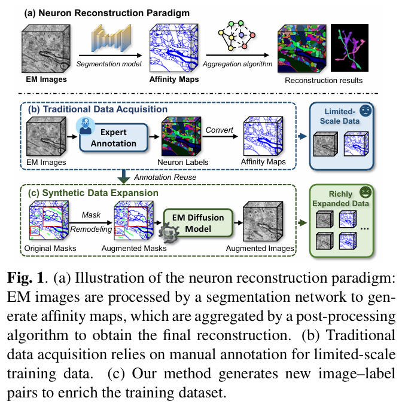
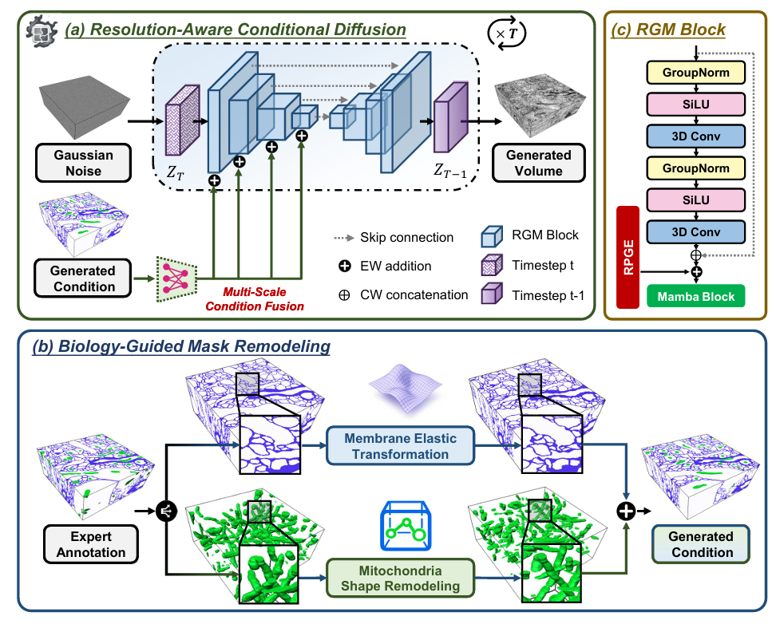
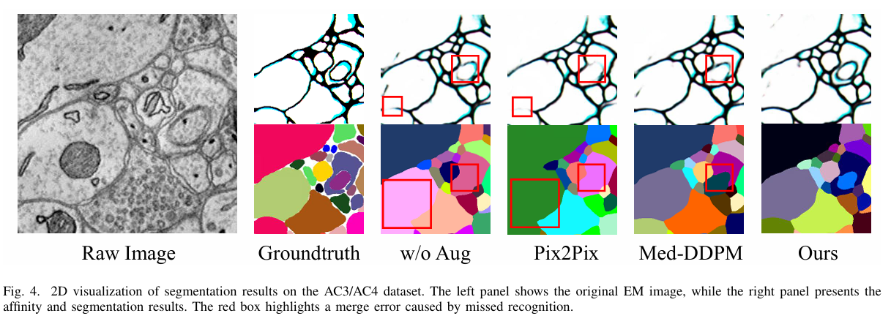

# NeuroDiff: Diffusion Model-Based Data Augmentation for Enhanced Neuron Segmentation

## 🌟 Introduction
Neuron segmentation in electron microscopy (EM) aims to reconstruct the 
complete neuronal connectome; however, current deep learning-based methods are 
limited by their reliance on large-scale training data and extensive, 
time-consuming manual annotations. Traditional methods augment the training set 
through contrast and geometric transformations; however, the generated samples 
remain highly correlated with the original images and lack structural 
diversity. To address this limitation, we propose a diffusion-based data 
augmentation framework capable of generating diverse and structurally plausible 
image–label pairs for neuron segmentation. The framework employs a 
resolution-aware conditional diffusion model with multi-scale conditioning and 
EM resolution priors to enable voxel-level image synthesis from 3D masks. It 
further incorporates a biology-guided mask remodeling module that produces 
augmented masks with enhanced structural realism. Together, these components 
effectively enrich the training set and improve segmentation performance. On 
the AC3 and AC4 datasets under low-annotation regimes, our method improves the 
ARAND metric by 32.1% and 30.7%, respectively, when combined with two 
distinct post-processing methods.

  
   

## 🔍 Overview of the proposed framework
The framework consists of two main components: (a) resolution-aware conditional diffusion and (b) biology-guided mask remodeling.

  
   

## 📈 Model Performance
Visual comparisons of the segmentation results illustrate that our augmentation strategy enhances the ability to identify membrane boundaries and reduces merge errors, ultimately improving neuron segmentation performance.

  
   

## 📚 Datasets

We use the following public datasets in our experiments:

- **[AC3/AC4](hhttps://lichtman.rc.fas.harvard.edu/vast/AC3AC4Package.zip)**: Mouse somatosensory cortex datasets imaged with FIB-SEM at 6×6×29 nm³ resolution.

> 💡 All datasets are publicly available. Please visit the official websites to download.

## ✅ To-Do List
The code and trained model weights will be publicly available upon paper acceptance.
- [x] 🧠 Provide access instructions for public datasets
- [ ] 📝 Open-source core code
- [ ] 📖 Write README for code usage
- [ ] ⚖️ Upload model weights
